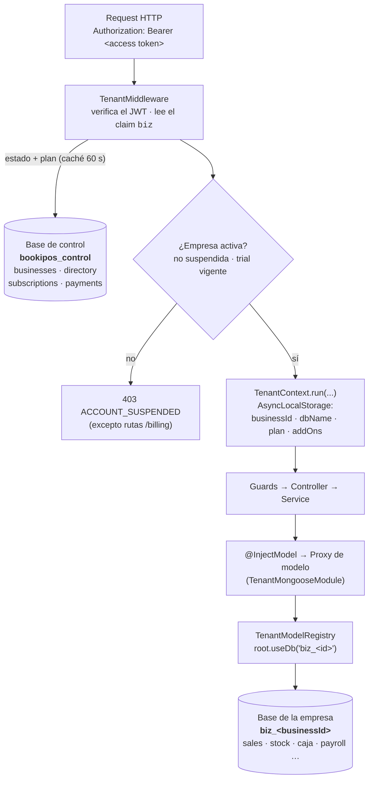

# BookiPos — Backend

API del POS multi-sede y multi-empresa de BookiPos: vende, controla el inventario, cuadra la caja, emite factura electrónica y liquida la nómina desde un solo servicio.

[](https://nodejs.org)
[](https://nestjs.com)
[](https://www.typescriptlang.org)
[-47A248?logo=mongodb&logoColor=white)](https://www.mongodb.com)
[](https://pnpm.io)
[](https://vitest.dev)

> Repositorio privado (`"private": true` en `package.json`). No incluye archivo `LICENSE`.

---

## Índice

- [Qué es este servicio](#qué-es-este-servicio)
- [Arquitectura](#arquitectura)
  - [Organización modular](#organización-modular)
  - [Multi-tenancy: una base de datos por empresa](#multi-tenancy-una-base-de-datos-por-empresa)
  - [Planes y entitlements](#planes-y-entitlements)
- [Mapa de módulos](#mapa-de-módulos)
- [Requisitos previos](#requisitos-previos)
- [Puesta en marcha](#puesta-en-marcha)
- [Scripts](#scripts)
- [Seeds](#seeds)
- [Variables de entorno](#variables-de-entorno)
- [Autenticación y seguridad](#autenticación-y-seguridad)
- [API](#api)
- [Testing](#testing)
- [Despliegue](#despliegue)
- [Estructura de carpetas](#estructura-de-carpetas)
- [Convenciones](#convenciones)

---

## Qué es este servicio

BookiPos es un sistema POS/ERP para negocios colombianos: restaurantes (comandas, mesas, propina, INC 8%) y retail (catálogo, variantes, IVA). Este repositorio contiene **la API REST**: toda la lógica de negocio, la persistencia y las integraciones externas. El frontend vive aparte, en `../Frontend`, y consume esta API.

El servicio resuelve, en un solo backend:

| Dominio | Qué cubre |
|---|---|
| **Punto de venta** | Ventas de contado y a crédito, cuentas abiertas, anulaciones, devoluciones, descuentos por sede, consecutivos atómicos por sede. |
| **Restaurante** | Mesas, comandas, envío a cocina, cuenta, propina y puente comanda → cuenta del POS para cobrar. |
| **Inventario** | Ítems (insumo / producto / montaje), variantes con SKU, categorías, lotes con vencimiento y consumo **FEFO**, kardex de movimientos, traslados entre sedes, alertas, importación/exportación CSV. |
| **Caja** | Turnos por sede: apertura con base, movimientos (ingreso/retiro/sangría), cierre con efectivo esperado vs. contado y tolerancia de descuadre. |
| **Facturación electrónica** | Documentos electrónicos (factura y nota crédito) con cálculo real de **CUFE** (SHA-384, Anexo Técnico DIAN 1.9), resolución de numeración por sede, medios de pago DIAN. |
| **Compras y proveedores** | Órdenes de compra con ciclo `draft → sent → partial/received → cancelled` y recepción que entra a inventario. |
| **Finanzas** | Gastos y categorías, gastos recurrentes automatizados, cuentas por pagar y por cobrar, tesorería y conciliación, presupuesto vs. real, P&L mensual y flujo de caja. |
| **Nómina (Colombia)** | Motor de cálculo puro (devengados, deducciones, aportes patronales, provisiones), recargos y horas extra con festivos colombianos (Ley Emiliani + Pascua), liquidación definitiva (art. 64 CST), colillas en PDF y envío por correo. |
| **RRHH y asistencia** | Expediente de empleados, cargos, registro de horas por sede y solicitudes de corrección con aprobación. |
| **Contabilidad y reportes** | Ledger de partida doble con asientos inmutables, balance de prueba, estado de resultados y balance general leídos **del ledger**. |
| **Suscripciones** | Planes, cuotas, complementos, cobro recurrente tokenizado con Wompi y bloqueo de cuentas suspendidas o con trial vencido. |

---

## Arquitectura

### Organización modular

NestJS con un módulo por área de negocio bajo `src/modules/`. Dentro de cada módulo se sigue una separación por capas al estilo hexagonal:

```
src/modules/<modulo>/
├── domain/           # constantes, enums, cálculos puros, invariantes (sin BD)
├── application/      # servicios de caso de uso + DTOs con class-validator
│   └── dto/
└── infrastructure/   # controladores HTTP, esquemas Mongoose, clientes externos
    └── schemas/
```

Los módulos se dividen en dos familias:

- **`core-*` — infraestructura de dominio transversal.** No representan una pantalla del producto: son motores que el resto consume (`core-auth`, `core-params`, `core-tax`, `core-ledger`, `core-audit`, `core-reports`).
- **Módulos de negocio.** Un área funcional del producto cada uno (`sales`, `inventory`, `caja`, `payroll`, `restaurant`, …).

Aparte quedan dos piezas especiales:

- **`control`** — el *control-plane*: registro de empresas, planes y complementos. Vive en su **propia base de datos**, fuera de los datos operativos de cualquier empresa.
- **`shared/tenancy`** — la infraestructura multi-empresa que enruta cada request a la base de datos correcta.

### Multi-tenancy: una base de datos por empresa

Es la decisión arquitectónica central del backend. **Cada empresa tiene su propia base de datos MongoDB** (`biz_<businessId>`), y un registro central en la base de control (`bookipos_control` por defecto) guarda quién es quién.



Cómo funciona, pieza por pieza:

| Pieza | Archivo | Responsabilidad |
|---|---|---|
| `TenantContext` | `shared/tenancy/tenant-context.ts` | Contexto de empresa propagado con `AsyncLocalStorage`. Expone `run()`, `current()` y `currentOrThrow()`. El nombre de base se deriva con `dbNameForBusiness(id)` → `biz_<id>`. |
| `TenantMiddleware` | `shared/tenancy/tenant.middleware.ts` | Middleware Express aplicado a `'*'`. Verifica el access token, toma el claim `biz`, consulta estado y plan en el control-plane (caché de 60 s, **fail-open** si el control-plane no responde), bloquea empresas suspendidas o con trial vencido y abre el contexto. Las rutas `/billing` quedan exentas del bloqueo: es justo donde el dueño paga para reactivarse. |
| `TenantModelRegistry` | `shared/tenancy/tenant-model.registry.ts` | Deriva la conexión de cada empresa desde **una sola conexión raíz** con `root.useDb(dbName, { useCache: true })` — mismo cliente y mismo pool para todas — y compila/cachea los modelos por base. |
| `createModelProxy` | `shared/tenancy/model-proxy.ts` | Envuelve un `Model` de Mongoose en un `Proxy` que resuelve el modelo real **en cada acceso**, contra la base de la empresa activa. Fuera de contexto el proxy es inerte (devuelve `undefined`), para que el arranque y la inyección de dependencias de Nest no exploten. |
| `TenantMongooseModule` | `shared/tenancy/tenant-mongoose.module.ts` | Sustituye a `MongooseModule.forFeature` en los módulos de negocio. Registra el proxy bajo el **mismo token** que usa `@InjectModel(X.name)`, así que ningún servicio necesita saber que es multi-empresa. |

Consecuencias prácticas que conviene tener presentes:

- Los servicios se escriben como si fueran mono-tenant: inyectan `@InjectModel(...)` y ya.
- **Todo trabajo fuera de una request HTTP** (seeders, tareas periódicas) debe abrir el contexto a mano. Ejemplos reales: `src/seed/with-business.ts` para los seeders, y `RecurringExpenseScheduler` / `BillingScheduler`, que iteran las empresas del control-plane y abren el contexto de cada una.
- La app arranca aunque Mongo no esté disponible (`lazyConnection: true`); `/health` reporta el estado real de la conexión.

### Planes y entitlements

El catálogo comercial es la única fuente de verdad y vive en `src/modules/control/domain/plans.ts`: planes (`punto`, `negocio`, `control`, `cadena`), features gateables, cuotas (sedes, usuarios, documentos electrónicos/mes, empleados de nómina), precios y complementos.

El gating es **ortogonal al RBAC**: aunque el Dueño tenga todos los permisos, si su plan no incluye la feature el endpoint responde **402 PLAN_UPGRADE_REQUIRED**. Lo aplica `FeatureGuard` sobre los handlers anotados con `@RequireFeature(...)` — hoy en `finance` (`accounting`, `expenses`), `inventory` (`transfers`), `payroll`, `purchasing` y `restaurant`. Es opt-in: sin anotación, pasa.

---

## Mapa de módulos

Todos los módulos están registrados en `src/app.module.ts`.

### Infraestructura de dominio (`core-*`) y control-plane

| Módulo | Ruta HTTP | Qué hace |
|---|---|---|
| `control` | — (sin controlador) | Control-plane: alta y consulta de empresas, directorio dueño→empresa, planes y complementos. Usa una conexión Mongoose dedicada (`CONTROL_CONNECTION`). Al crear una empresa fija su `dbName = biz_<_id>`. |
| `core-auth` | `/auth`, `/users`, `/roles`, `/permissions`, `/invitations` | Login, registro público de empresa, refresh, logout, perfil. Usuarios, roles dinámicos en BD (sembrados desde `SYSTEM_ROLES`), catálogo de permisos e invitaciones por correo. Registra los tres guards globales. |
| `core-params` | `/params` | Catálogo extensible de parámetros **con vigencia por fecha**: nunca se sobrescribe un valor, se agrega una versión con `effectiveFrom`. Resuelve el valor vigente a una fecha, con override opcional por sede. |
| `core-tax` | `/taxes` | Motor de impuestos configurable (`iva`, `inc`, `exento`, `excluido`) con tarifas versionadas por vigencia. `GET /taxes/compute` calcula impuesto y total sobre una base a una fecha dada. |
| `core-ledger` | `/ledger` | Ledger de partida doble: plan de cuentas, asientos **inmutables** (se reversan con contra-asiento, nunca se editan), validación de débitos = créditos y balance de prueba. `LedgerPostingService` traduce eventos de negocio (venta, gasto, pago, compra, nómina) a asientos balanceados, de forma idempotente por `(sourceType, sourceId)`. |
| `core-audit` | `/audit` | Auditoría inmutable append-only. `AuditInterceptor` (global, registrado al final para envolver al resto) persiste toda escritura `POST/PATCH/PUT/DELETE` con usuario, ruta, IP, duración y resultado; los errores de negocio también quedan registrados. Las lecturas `GET` no dejan rastro. |
| `core-reports` | `/reports` | Estado de resultados, balance general y balance de prueba **leídos del ledger**, nunca de las tablas operativas. El reporte de ventas sí consulta la operación, para la vista del día a día. |

### Módulos de negocio

| Módulo | Ruta HTTP | Qué hace |
|---|---|---|
| `health` | `/health` | Endpoint público con estado del proceso y de la conexión a Mongo. |
| `sedes` | `/sedes` | Sedes/puntos de venta, con los datos fiscales del emisor y la resolución de numeración DIAN (prefijo, rango, vigencia, clave técnica). |
| `inventory` | `/inventory` | Productos e insumos, variantes con SKU, categorías, existencias por sede, lotes con vencimiento (**FEFO**), kardex, ajustes, mermas, traslados, alertas e importación CSV de catálogo y existencias. Único módulo que usa transacciones de Mongo, con degradación automática si el servidor no las soporta. |
| `catalog` | `/catalog` | Productos vendibles del POS. Cada uno se abastece por `inventory` (descuenta `qtyPerUnit` de un ítem) o por `recipe` (descuenta cada ingrediente). Lleva la tarifa de IVA del producto. |
| `suppliers` | `/suppliers` | Proveedores con documento (`NIT`/`CC`), contacto, ciudad, categoría y estado. |
| `sales` | `/sales`, `/orders` | Ventas del POS (contado y crédito), productos vendibles listos para vender, estadísticas y anulación. `/orders` gestiona cuentas abiertas con checkout y anulación. Consecutivos atómicos por sede vía colección `counters` (`$inc` con upsert, sin necesidad de transacción). |
| `caja` | `/caja` | Turnos de caja por sede: apertura con base, movimientos (`in`, `out`, `sangria`), cierre con efectivo esperado (base + ventas en efectivo + ingresos − salidas) contra el contado, tolerancia de descuadre, historial de cierres y panorama del día por sede. |
| `discounts` | `/discounts` | Descuentos predefinidos por sede (`percent` o `amount`), activables/desactivables, que el POS ofrece por línea. Todas las operaciones validan el acceso del usuario a la sede. |
| `restaurant` | `/restaurant` | Mesas (`free`/`occupied`/`bill_requested`) y comandas: ítems, envío a cocina, cuenta, propina y **puente comanda → caja** para cobrar en el POS. Resuelve INC y propina sugerida en caliente desde `core-tax` y `core-params`, con constantes de respaldo si esos motores fallan. |
| `einvoicing` | `/einvoicing` | Emite el documento electrónico a partir de una venta y su nota crédito de anulación. Calcula el **CUFE** real (SHA-384 sobre los campos en el orden del Anexo Técnico DIAN 1.9), asigna consecutivo dentro de la resolución de la sede, mapea medios de pago DIAN y usa el NIT de consumidor final cuando la venta no identifica adquiriente. Sin proveedor tecnológico conectado opera en ambiente de pruebas (`TipoAmbiente = 2`). |
| `customers` | `/customers` | Directorio de clientes para facturación y cuentas por cobrar. Un fiado siempre apunta a un cliente registrado (o a un empleado, que se descuenta por nómina). |
| `purchasing` | `/purchasing/orders` | Órdenes de compra: creación, edición, envío al proveedor, cancelación y recepción (total o parcial) que impacta el inventario. Consecutivo propio. |
| `finance` | `/finance` | Categorías y gastos, plantillas de gasto recurrente con generación automática idempotente, cuentas por pagar y por cobrar con abonos, tesorería (cuentas, movimientos, conciliación), presupuestos y su comparación contra el real, P&L, P&L mensual, panorama y flujo de caja. |
| `employees` | `/employees`, `/positions` | Expediente de RRHH y cargos, con los enums de contratación y seguridad social colombianos (tipos de documento, tipos de contrato, tipo de salario). |
| `attendance` | `/attendance` | Registro de horas por empleado, sede y día (un registro por combinación), resumen, registro administrativo y **solicitudes de corrección** que el responsable aprueba o rechaza: el registro es inmutable desde el POS. |
| `payroll` | `/payroll` | Motor de nómina mensual (Colombia): ajustes del motor, previsualización, novedades desde asistencia, corridas (crear, recalcular, cerrar, eliminar), deducciones con aprobación/rechazo, liquidación definitiva y envío de la colilla en PDF por correo. Los cálculos viven en `domain/` como funciones puras y están cubiertos por tests. |
| `billing` | `/billing` | Suscripciones y cobro con **Wompi** (tokenizado recurrente): configuración pública, estado, alta, compra de paquetes de documentos, cancelación y webhook. Opera sobre el control-plane. El webhook es público y valida el checksum del evento; el resto exige `params.manage`. La aplicación de entitlements es idempotente para tolerar webhooks repetidos. |

---

## Requisitos previos

- **Node.js >= 20** (declarado en `engines`).
- **pnpm** — el repo trae `pnpm-lock.yaml` y `pnpm-workspace.yaml`. Existe además un `package-lock.json` residual; **no lo uses**.
- **MongoDB 7 como replica set**. El `docker-compose.yml` incluido levanta uno de un solo nodo ya inicializado; también sirve MongoDB Atlas, que viene en replica set.

> El replica set no es cosmético: `inventory` ejecuta sus operaciones de stock dentro de transacciones multi-documento. Contra un `mongod` suelto degrada a ejecución sin sesión (con un warning), así que el sistema arranca, pero pierde la atomicidad.

---

## Puesta en marcha

```bash
# 1. Clonar y entrar al backend
git clone <url-del-repo> BookiPos
cd BookiPos/Backend

# 2. Instalar dependencias
pnpm install

# 3. Configurar el entorno
cp .env.example .env
#    Mínimo indispensable para arrancar: JWT_SECRET (el arranque falla sin él).
#    Genera uno:
node -e "console.log(require('crypto').randomBytes(48).toString('base64url'))"

# 4. Levantar MongoDB como replica set (mongo:7 + init del rs0)
docker compose up -d

# 5. Sembrar datos mínimos (empresa, sede, rol Dueño, proveedores de ejemplo)
pnpm seed

# 6. Arrancar en desarrollo, con recarga en caliente
pnpm dev
```

La API queda en **http://localhost:3001** (configurable con `PORT`). Comprobación rápida:

```bash
curl http://localhost:3001/health
# {"status":"ok","db":"connected","time":"2026-..."}
```

Credenciales que deja `pnpm seed` en desarrollo: `admin@sistemapos.local` / `Admin123!` (ajustables con `SEED_ADMIN_EMAIL` y `SEED_ADMIN_PASSWORD`).

---

## Scripts

| Script | Comando real | Qué hace |
|---|---|---|
| `pnpm dev` | `nest start --watch` | Servidor de desarrollo con recarga en caliente. |
| `pnpm build` | `tsc -p tsconfig.json` | Compila TypeScript a `dist/`. |
| `pnpm start` | `node dist/main.js` | Ejecuta el build compilado. |
| `pnpm seed` | `tsc && node dist/seed.js` | Siembra mínima para arrancar (compila antes). |
| `pnpm seed:demo` | `tsc && node dist/seed-demo.js` | Siembra un negocio completo de demostración. |
| `pnpm seed:payroll` | `tsc && node dist/seed-payroll.js` | Siembra solo nómina (cargos, empleados, corridas). |
| `pnpm test` | `vitest run` | Corre la suite una vez. |
| `pnpm test:watch` | `vitest` | Suite en modo watch. |
| `pnpm lint` | `echo "TODO: eslint" && exit 0` | **Placeholder.** Hoy no hay linter configurado; el script existe para no romper pipelines. |

---

## Seeds

Los tres seeders comparten el helper `src/seed/with-business.ts`, que abre el contexto de la empresa correspondiente (creándola en el control-plane si no existe, identificada por el correo del dueño) y corre el sembrado dentro de su base `biz_<id>`. Los tres son **idempotentes**.

| Comando | Archivo | Empresa que usa | Qué siembra |
|---|---|---|---|
| `pnpm seed` | `src/seed.ts` | «Negocio (seed)» · `SEED_ADMIN_EMAIL` (por defecto `admin@sistemapos.local`) | Lo mínimo para operar: roles de sistema (`owner`, `admin`, `manager`, `cashier`), una sede (`DEFAULT_SEDE`, por defecto `centro`), el usuario Dueño y cinco proveedores de ejemplo. Si el admin ya existía con otro rol, lo migra a Dueño. |
| `pnpm seed:demo` | `src/seed-demo.ts` | «Restaurante Demo» · `SEED_DEMO_EMAIL` (por defecto `demo@sistemapos.local`) | Un negocio **completo** que ejercita todos los módulos **usando los servicios reales**: dispara FEFO, consecutivos y el posteo automático al ledger. Cada sección se siembra de forma tolerante a fallos y al final imprime un resumen de lo logrado y lo fallido, más las credenciales. Guardado por usuario: si el usuario demo ya existe no repite la data transaccional (evita duplicar consecutivos); se fuerza con `SEED_FORCE=1`. |
| `pnpm seed:payroll` | `src/seed-payroll.ts` | La misma empresa demo | Solo nómina, en modo *standalone* y con «top up»: ajustes del motor, cargos, roster de empleados y varias corridas mensuales — por defecto los últimos 3 meses, configurable con `SEED_PAYROLL_PERIODS` (`AAAA-MM`, separados por coma). Reutiliza la sede `centro` y al usuario demo como actor. Imprime cargos, empleados creados/existentes, corridas creadas/omitidas y el neto de la última. |

> En producción, `pnpm seed` **exige** `SEED_ADMIN_PASSWORD`: se niega a correr antes que dejar una cuenta con contraseña conocida.

---

## Variables de entorno

La referencia completa, comentada y con los valores de producción, está en **[`.env.example`](.env.example)**. Cópialo a `.env` (ya está en `.gitignore`) y ajústalo. Los grupos son:

| Grupo | Variables | Notas |
|---|---|---|
| **Base de datos** | `MONGODB_URI`, `CONTROL_MONGODB_URI` | La base de control se deriva de `MONGODB_URI` cambiando el nombre a `bookipos_control`; `CONTROL_MONGODB_URI` la fija aparte. El replica set es obligatorio. |
| **Servidor** | `PORT`, `NODE_ENV`, `CORS_ORIGIN` | `CORS_ORIGIN` admite varios orígenes separados por coma. Con `NODE_ENV=production` la cookie de refresh pasa a `Secure` y los orígenes `localhost`/`http` se filtran del CORS con una advertencia. |
| **Autenticación** | `JWT_SECRET`, `JWT_REFRESH_SECRET`, `JWT_ACCESS_EXPIRES`, `JWT_REFRESH_EXPIRES`, `AUTH_COOKIE_SAMESITE`, `AUTH_COOKIE_DOMAIN` | Sin `JWT_REFRESH_SECRET` se usa `JWT_SECRET`; nunca hay valor por defecto. |
| **Correo** | `RESEND_API_KEY`, `MAIL_FROM`, `APP_URL`, `INVITE_EXPIRES_DAYS` | Vía Resend, para invitaciones y colillas de nómina. Sin `RESEND_API_KEY` el envío no falla: registra el correo y el enlace en el log. `APP_URL` apunta al **frontend**. |
| **Pagos (Wompi)** | `WOMPI_ENV`, `WOMPI_BASE_URL`, `WOMPI_PUBLIC_KEY`, `WOMPI_PRIVATE_KEY`, `WOMPI_INTEGRITY_SECRET`, `WOMPI_EVENTS_SECRET` | Sandbox por defecto. El webhook a registrar en Wompi es `POST /billing/webhook`. |
| **Seeders** | `SEED_ADMIN_EMAIL`, `SEED_ADMIN_PASSWORD`, `DEFAULT_SEDE`, `SEED_DEMO_EMAIL`, `SEED_DEMO_PASSWORD`, `SEED_PAYROLL_PERIODS`, `SEED_FORCE` | Solo para entornos de prueba. No definir en producción. |

**Obligatorias para arrancar:**

- `JWT_SECRET` — `jwtSecret()` lanza y **el arranque falla** si falta o está vacío. No hay fallback inseguro.
- `MONGODB_URI` — tiene valor por defecto (`mongodb://localhost:27017/sistema-pos?replicaSet=rs0`), pero en cualquier entorno real hay que fijarlo.
- `CORS_ORIGIN` — por defecto `http://localhost:3000`; obligatorio en producción, donde los orígenes inseguros se descartan.

---

## Autenticación y seguridad

**Tokens.** JWT con Passport (`passport-jwt`). El *access token* dura 15 minutos por defecto (`JWT_ACCESS_EXPIRES`) y lleva los claims `biz` (empresa) y `biztype` (giro del negocio), que alimentan el contexto multi-empresa. El *refresh token* (7 días) viaja en una **cookie HttpOnly** llamada `refresh_token`, acotada a la ruta `/auth` — fuera del alcance de JavaScript, así que un XSS no puede robar la credencial durable. Se acepta el refresh token en el body solo como respaldo para clientes no migrados. En producción la cookie es `Secure`; `SameSite` es `lax` por defecto.

**Tres guards globales**, registrados vía `APP_GUARD`:

1. `JwtAuthGuard` — exige access token válido salvo en handlers marcados con `@Public()` (login, registro, refresh, health, webhook de Wompi).
2. `PermissionsGuard` — **deny-by-default**: si un handler no es `@Public()`, no declara `@RequirePermissions(...)` y no se marcó con `@NoPermissionRequired()`, responde **403**. Un endpoint nuevo sin decorar queda cerrado por omisión.
3. `FeatureGuard` — gating por plan; **402 PLAN_UPGRADE_REQUIRED** si el plan del tenant no incluye la feature anotada con `@RequireFeature(...)`.

A ellos se suma el `ThrottlerGuard`, también global.

**RBAC.** Permisos granulares `modulo.accion` en `core-auth/domain/permissions.ts` (`pos.sell`, `caja.close`, `inventory.transfer`, `payroll.manage`, `einvoicing.issue`, …), agrupados con etiquetas en español para pintar la UI. Los roles viven en una colección de MongoDB y se siembran desde `SYSTEM_ROLES`; el dueño puede crear roles propios. Un usuario tiene una clave de rol más permisos extra opcionales. Encima del RBAC va el **control de acceso por sede** (`assertSedeAccess`), que los servicios aplican en cada operación con `sedeId`.

**Rate limiting.** `@nestjs/throttler`: 100 req/min por IP en toda la API. Los endpoints sensibles aprietan más con `@Throttle`: login y registro a 5 intentos / 5 minutos, refresh a 10 / 5 minutos.

**Endurecimiento HTTP.** `helmet()` antes de cualquier ruta; `cookie-parser`; `trust proxy = 1` para que `req.ip` salga del primer salto confiable y no de un header falseable; `ValidationPipe` global con `whitelist`, `forbidNonWhitelisted` y `transform` (un campo no declarado en el DTO **rechaza** la request).

**Bloqueo de cuentas.** El `TenantMiddleware` corta el acceso de empresas `suspended` o con trial vencido con un 403 discriminado (`code: ACCOUNT_SUSPENDED`, `reason: suspended | trial_expired`) para que el frontend muestre el aviso de reactivación en vez de un «sin acceso» genérico. Las rutas `/billing` quedan exentas.

**Auditoría.** Toda escritura queda en el log inmutable con usuario, ruta, IP, duración y resultado, incluidos los fallos.

---

## API

**No hay Swagger/OpenAPI configurado** en este repositorio: `main.ts` no registra `SwaggerModule` y `@nestjs/swagger` no está entre las dependencias. La referencia de endpoints son los controladores.

- **Prefijo global: ninguno.** No se llama a `setGlobalPrefix()`, así que las rutas cuelgan de la raíz: `POST /auth/login`, `GET /sales`, `POST /caja/open`, etc.
- **Health check:** `GET /health` — público, sin token.

  ```json
  { "status": "ok", "db": "connected", "time": "2026-08-28T12:00:00.000Z" }
  ```

  `db` puede ser `connected`, `disconnected`, `connecting`, `disconnecting` o `unknown`. El proceso arranca aunque Mongo esté caído y Mongoose reconecta en segundo plano.

- **CORS con credenciales** habilitado para los orígenes de `CORS_ORIGIN`.

Raíces de ruta expuestas:

`/health` · `/auth` · `/users` · `/roles` · `/permissions` · `/invitations` · `/sedes` · `/inventory` · `/catalog` · `/suppliers` · `/sales` · `/orders` · `/caja` · `/discounts` · `/restaurant` · `/einvoicing` · `/customers` · `/purchasing/orders` · `/finance` · `/employees` · `/positions` · `/attendance` · `/payroll` · `/params` · `/taxes` · `/ledger` · `/reports` · `/audit` · `/billing`

---

## Testing

Vitest con SWC (`unplugin-swc`), que emite la metadata de decoradores igual que `tsc` para que los esquemas de `@nestjs/mongoose` se resuelvan dentro de un test. Los tests son **unitarios y deterministas**: instancian los servicios con dependencias mockeadas, sin el contenedor de DI de Nest y sin Mongo real.

```bash
pnpm test         # una pasada
pnpm test:watch   # modo watch
```

Se recogen los archivos `src/**/*.spec.ts`. La suite actual cubre los flujos críticos: cálculo de nómina, cierre de caja, consecutivos (ventas, compras, restaurante), checkout y anulación de ventas, impuestos en la venta, puente comanda → caja, acceso por sede, cookie de refresh y validación de secretos JWT.

---

## Despliegue

El servicio se despliega en **Vercel**. No hay `vercel.json` en el repositorio: la configuración vive en el panel de Vercel.

```bash
pnpm install
pnpm build     # tsc -> dist/
pnpm start     # node dist/main.js
```

Lista de verificación antes de publicar:

- `NODE_ENV=production` — sin esto la cookie de refresh no es `Secure` y la sesión no persiste detrás de HTTPS.
- `JWT_SECRET` y `JWT_REFRESH_SECRET` largos, aleatorios y distintos entre sí.
- `MONGODB_URI` apuntando a un clúster en replica set (Atlas, por ejemplo).
- `CORS_ORIGIN` con los dominios `https` del frontend. Los `localhost`/`http` se descartan automáticamente.
- `APP_URL` apuntando al frontend (no al API) y `MAIL_FROM` con un dominio verificado en Resend con SPF/DKIM publicados.
- Llaves de Wompi de producción y webhook registrado en `https://<tu-api>/billing/webhook`.
- **Nunca** definir las variables `SEED_*` en producción.

---

## Estructura de carpetas

```
Backend/
├── docker-compose.yml          # MongoDB 7 en replica set de un nodo + init
├── nest-cli.json
├── tsconfig.json               # paths @modules/* @shared/* @config/*
├── tsconfig.build.json
├── vitest.config.ts            # Vitest + SWC + tsconfig paths
├── pnpm-workspace.yaml
├── .env.example                # referencia completa de variables
└── src/
    ├── main.ts                 # bootstrap: helmet, cookies, CORS, ValidationPipe
    ├── app.module.ts           # config, dos conexiones Mongo, throttler, módulos
    ├── seed.ts                 # siembra mínima
    ├── seed-demo.ts            # siembra de demostración completa
    ├── seed-payroll.ts         # siembra de nómina
    ├── seed/
    │   ├── with-business.ts    # abre el contexto de empresa para los seeders
    │   └── payroll.seed.ts
    ├── shared/
    │   ├── config/
    │   │   └── jwt-secrets.ts  # secretos obligatorios, sin fallback inseguro
    │   ├── money/
    │   │   └── Money.ts        # value object (centavos en bigint)
    │   └── tenancy/            # ── infraestructura multi-empresa ──
    │       ├── tenant-context.ts        # AsyncLocalStorage
    │       ├── tenant.middleware.ts     # abre el contexto desde el JWT
    │       ├── tenant-model.registry.ts # useDb por empresa
    │       ├── tenant-mongoose.module.ts# reemplazo de forFeature
    │       ├── model-proxy.ts           # Proxy de Model resuelto por request
    │       └── tenancy.module.ts
    └── modules/
        ├── control/            # control-plane: empresas, planes, complementos
        ├── core-auth/          # JWT, RBAC, usuarios, roles, invitaciones
        ├── core-audit/         # auditoría inmutable + interceptor global
        ├── core-params/        # parámetros con vigencia
        ├── core-tax/           # motor de impuestos con vigencia
        ├── core-ledger/        # partida doble + posteo automático
        ├── core-reports/       # estados financieros desde el ledger
        ├── health/
        ├── sedes/
        ├── inventory/          # stock, lotes FEFO, kardex, traslados
        ├── catalog/            # productos vendibles (ítem o receta)
        ├── suppliers/
        ├── sales/              # ventas y cuentas abiertas
        ├── caja/               # turnos, movimientos, cierre
        ├── discounts/
        ├── restaurant/         # mesas y comandas
        ├── einvoicing/         # documentos DIAN + CUFE
        ├── customers/
        ├── purchasing/
        ├── finance/            # gastos, CxP/CxC, tesorería, presupuesto, P&L
        ├── employees/
        ├── attendance/
        ├── payroll/            # motor Colombia + colillas PDF
        └── billing/            # suscripciones Wompi
```

Cada módulo de negocio repite el patrón `domain/` · `application/` (+ `dto/`) · `infrastructure/` (+ `schemas/`).

---

## Convenciones

**Commits — Conventional Commits en español.** El historial usa `tipo(alcance): descripción` con la descripción escrita en español:

```
feat(planes): catálogo de 4 planes + gating real por plan y cuotas
fix(seguridad): mover el refresh token a cookie HttpOnly (#9)
refactor(marca): completar el renombrado de GoCheck a BookiPos
test(backend): runner de tests (Vitest+swc) + suites de los flujos críticos
chore: commit vacío para forzar redeploy en Vercel
```

Tipos observados: `feat`, `fix`, `refactor`, `test`, `chore`, `revert`. Alcances habituales: el módulo o el área (`planes`, `billing`, `nomina`, `inventario`, `caja`, `finanzas`, `seguridad`, `rbac`, `pos`, `restaurante`).

**Reglas de código que el repositorio sí sostiene:**

- **Asientos inmutables.** Un asiento del ledger nunca se edita: se reversa con un contra-asiento. Cada asiento está balanceado y referencia el evento que lo originó (`sourceType`/`sourceId`).
- **Vigencias, no sobrescrituras.** Parámetros (`core-params`) e impuestos (`core-tax`) se versionan por `effectiveFrom`; el valor vigente es la versión con la mayor fecha `<=` la consultada. Una vigencia publicada no se edita.
- **Los reportes leen del ledger.** Estado de resultados y balance general salen del ledger, no de las tablas operativas.
- **Auditoría append-only** de toda escritura.
- **Multi-sede desde el modelo**, con control de acceso por sede en cada operación.
- **Deny-by-default en la API:** un endpoint sin permiso declarado queda cerrado.

**Sobre el dinero.** El núcleo financiero actual trabaja en **COP entero** (sin centavos): `finance/domain/money.util.ts` redondea a peso y `core-ledger` documenta explícitamente ese enfoque pragmático. `shared/money/Money.ts` existe como value object con centavos en `bigint` (pensado para persistirse como `Decimal128`) y es el destino previsto de una migración futura, pero **hoy no es lo que usan los módulos**. Conviene no mezclar ambos criterios dentro de un mismo módulo.

**Nomenclatura.** Alias de import configurados en `tsconfig.json`: `@modules/*`, `@shared/*`, `@config/*`. Comentarios y mensajes de usuario en español; identificadores de código en inglés salvo los términos de dominio ya asentados (`sede`, `caja`, `nomina`).
